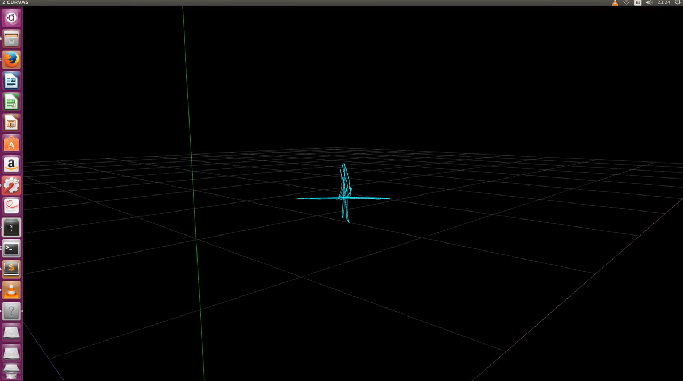
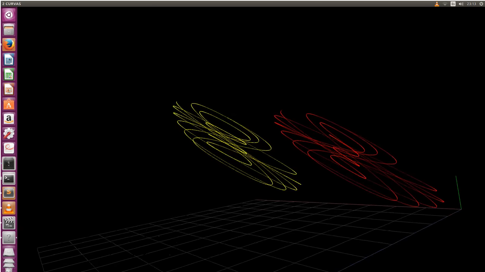
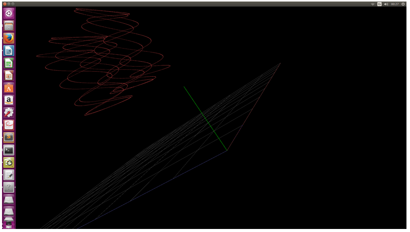

## 24-30 October 2017

Modeling the Transformator into a C++ class. Playing with transformator class.

## 18-24 October 2017 

Programming c++ to perform transformations on datafile of ground_truth positions. Rereading Victor Arribas Tesis

## 16, 17 October 2017

Reading about quaternions and OpenGL

## 14 , 15 October 2017

Reading x,y,z coordinates from a TUM file and drawing the 3D curve on screen. 

## 13 October 2017

Uploaded a video on youTube that draws 2 similar curves using Pangolin and OpenGl 

## 9 October 2017

Manage to draw a curve on screen 

## 6 to 8 october 2017

Reading about Pangolin

Looking for documentation

Looking at Eduardo graphic implementation of SDVL with Pangolin

Reading Pangolin Examples code

Learning how to compile Pangolin c++ code.

Reading OpenGL documentation

First steps coding with Pangolin.

Manage to draw a grid on screen.

Dealing with OpenGL flickering

## 3 october 2017

Create a small python script to create a new output file based on small modifications on the groundTruth file.

Testing the TUM tools to estimate error .

Document explaining tests performed is uploaded on github here [4](https://github.com/elibm/2017-tfm-elias-barcia/blob/master/resumen_2017oct03.odt).

Python code uploaded here [5](https://github.com/elibm/2017-tfm-elias-barcia/blob/master/modiFile.py).

TUM groundTruth data file is uploaded here [6](https://github.com/elibm/2017-tfm-elias-barcia/blob/master/groundTruth_freiburg1_xyz.txt)

New data file based on groundTruth file uploaded here [7](https://github.com/elibm/2017-tfm-elias-barcia/blob/master/misalida.txt)

## 1,2 october 2017 

Reading and testing TUM python code tools to evaluate the SLAM/tracking results at [8](https://vision.in.tum.de/data/datasets/rgbd-dataset/tools#evaluation)

Python code could be downloaded from here [9](https://svncvpr.in.tum.de/cvpr-ros-pkg/trunk/rgbd_benchmark/rgbd_benchmark_tools/src/rgbd_benchmark_tools/).

Using as input data [10](https://cdn3.vision.in.tum.de/rgbd/dataset/freiburg1/rgbd_dataset_freiburg1_xyz-groundtruth.txt)
