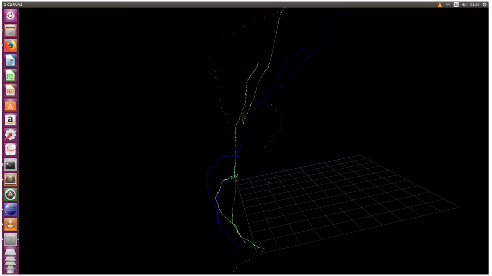
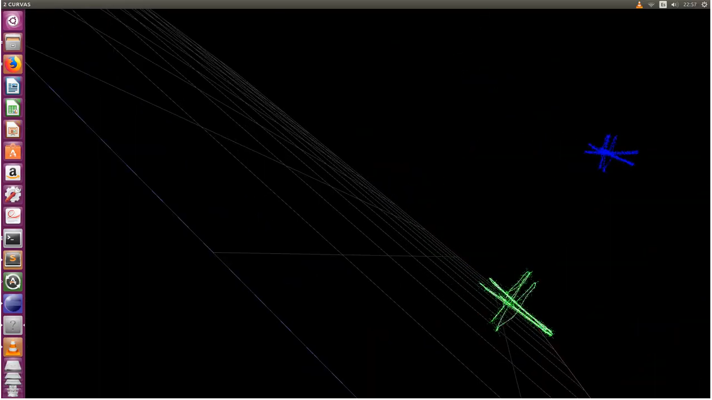
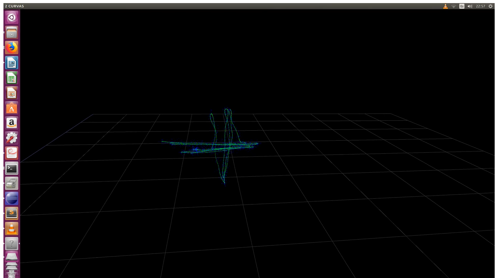
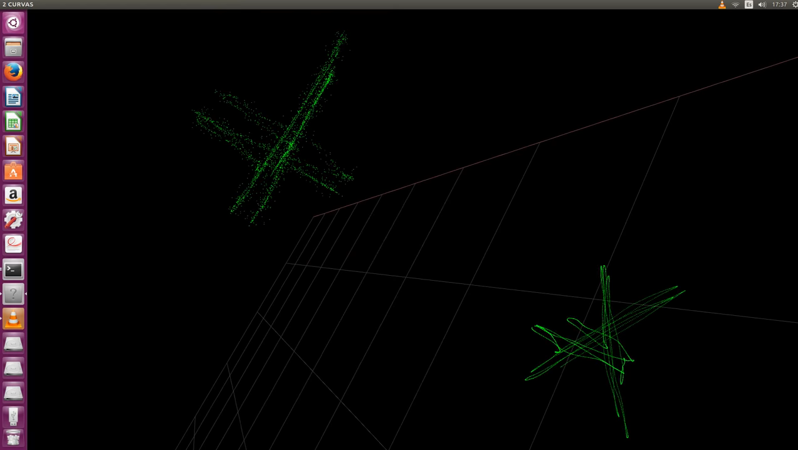
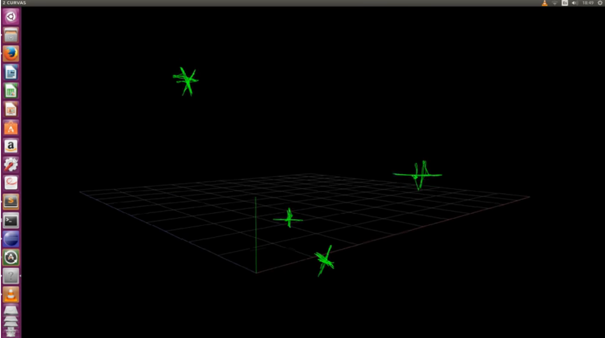

## 30 November:

Finally, after dealing with Eigen C++ library , I managed to translate to C++ the python code based on SVD that calculates the rotation and traslation matrix for the Register Module 

## 29 November:

Uploaded to github Register module in C++. Still working on it. Change visual interface. Background set to white to distinguish much better every point 

## 23 November:

Getting familiar with Eigen C++ library 

## From 18 November to 22 November:

Testing method Horn to align two trajectories

Original Evaluate_ate.py could be downloaded from

[https://svncvpr.in.tum.de/cvpr-ros-pkg/trunk/rgbd_benchmark/rgbd_benchmark_tools/src/rgbd_benchmark_tools/](https://svncvpr.in.tum.de/cvpr-ros-pkg/trunk/rgbd_benchmark/rgbd_benchmark_tools/src/rgbd_benchmark_tools/)

Also reading Method Horn paper: [https://ylatif.github.io/movingsensors/cameraReady/paper07.pdf](https://ylatif.github.io/movingsensors/cameraReady/paper07.pdf)

Created 2 more videos, on color white is presented ground truth trajectory , on blue is presented the artificial trajectory with gaussian noise, and finally on green is presented the align of second trajectory with the groundtruth trajectory. 

## From 5 November to 17 November

Reading documentation about how to fit or calculate rotation matrix and traslation using two datasets, the original and the transformed dataset.

Found a method using SVD.

Testing and modifying code found at [http://nghiaho.com/uploads/code/rigid_transform_3D.py_](http://nghiaho.com/uploads/code/rigid_transform_3D.py_)

Generate video with three trajectorys, the one in white color shows the original dataset or ground truth, the second in blue , shows the artificial dataset after being rotated , traslated and applied a gaussian noise, and the last one in green shows the ground thruth transformed by the estimated rotation matrix and estimated traslation vector. The centroids are represented by a tiny red dot. 

## 4 November 2017

Added Gaussian Noise into C++ program. Using Box-Muller transformation [https://en.wikipedia.org/wiki/Box%E2%80%93Muller_transform](https://en.wikipedia.org/wiki/Box%E2%80%93Muller_transform)

New video, showing a curve with Gaussian noise 

## 01 November 2017

New video , transforming trajectory with rotations and tralations

