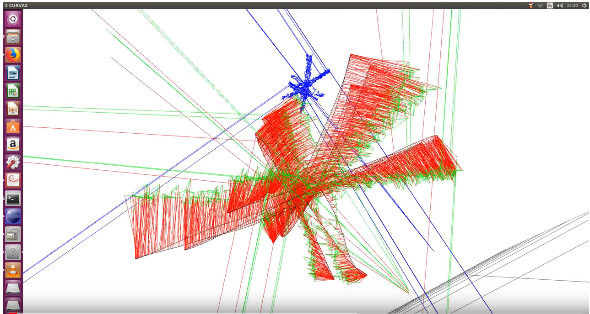
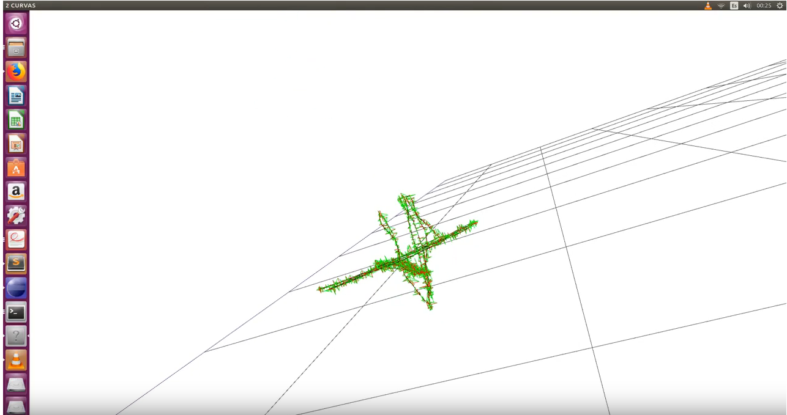
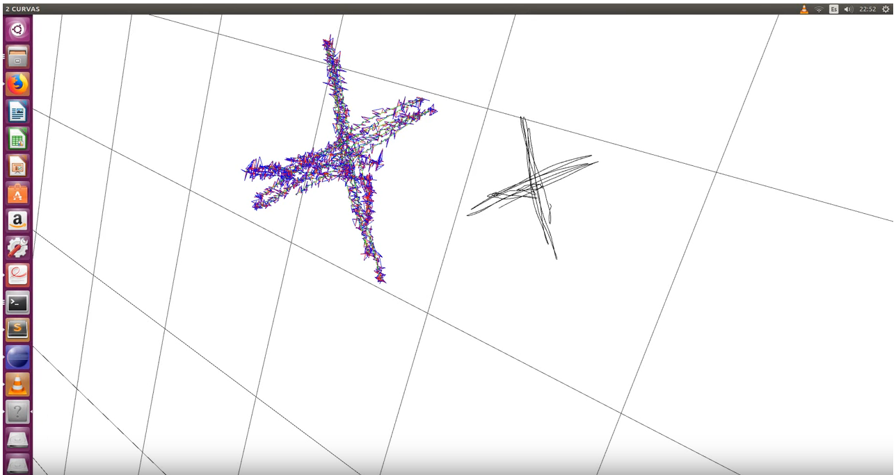
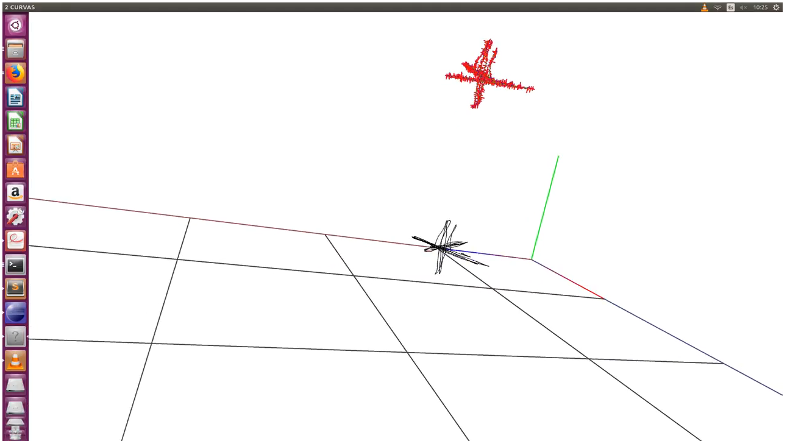

## 27 December: 

Added cosmic noise to the Transformation module. In this way , we'll create the artificial data with cosmic noise. This will have great impact on the results of the Register module, because of this the estimation will be less accurate Here is a video, the red segments shows the big difference between the groundtruh and the estimated data. 

## 26 December:

Reading about one point Ransac , also reviewing Victor Arribas projec

## 12 December:

Testing new register module in C++. This new module is usign Horn method with SVD. The code is based on the python code of evaluate_ate.py from TUM.

Also added new video to youtube. 

This video presents 3 graphics. The first one, is the ground truth trajectory, drawn in black dots. Called Dataset A. The second one, in blue dots, shows an artificial trajectory after applying some rotation, traslation and gaussian noise over the ground truth data.Called DataSet B. The third one , in green dots , is the result of estimating rotation and traslation matrix (using DataSet A and B to calculate the estimation ) and applied again over DataSet B , trying to reverse the original rotation and traslation. Called DataSet C. 

<pre>
The red segments ,shows the error between black and green dots, or the error between DataSet A and DataSet C
</pre>

## 4 December:

Connecting every 3d point with a line 

## 2 December:

Drawing in red color the error between dots

Uploaded new video, using C++ Register module that is using SVD methor for fitting rotation and traslation matrix 

This video presents 3 graphics. The first one, is the ground truth trajectory, drawn in black dots. Called Dataset A. The second one, in blue dots, shows an artificial trajectory after applying some rotation, traslation and gaussian noise over the ground truth data.Called DataSet B. The third one , in green dots (almost not visible) , is the result of estimating rotation and traslation matrix (using DataSet A and B to calculate the estimation ) and applied again over the ground truth dots. Called DataSet C. 

<pre>
The red segments ,shows the error between blue and green dots, or the error between DataSet B and DataSet C
</pre>

## 1 December:

Corrected minor errors on C++ code. Now the code is able to load matrix dinamically, no matter the size (limit 6000 3d points) 

