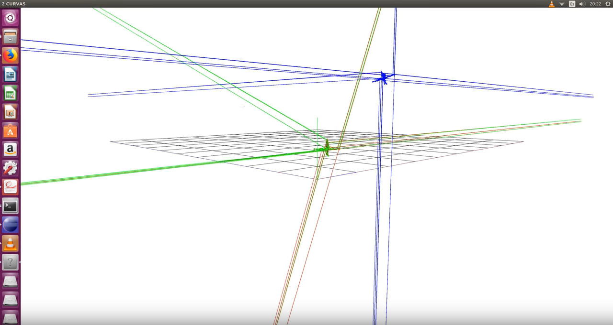

## 24 to 30 January 2018:

Reading about how to calculate PCA using SVD

Created C++ code using eigen library, trying to calculate PCA using SVD

## 23 January 2018:

Reading about PCA applied in a cloud of 3d points

Added a method to find the scale of 2 clouds of 3D points. The same method that Victor suggested in his paper.

## 20 January 2018:

Reading Victor's project, about how to calculate scale

## 16 January 2018:

Adding Scale to transformation module 

## 13 and 14 January 2018:

Implementing SVD-Ransac, trying to create a new Registration Module that estimates Rotation and Traslation matrix applying SVD-RANSAC to the data with cosmic noise. Uploaded first version to github. Uploaded new video 

## 9 January 2018:

Implementing Ransac, trying to create a new Registration Module that estimates Rotation and Traslation matrix applying RANSAC (with Horn method) to the data .

Uploaded first version to github 

