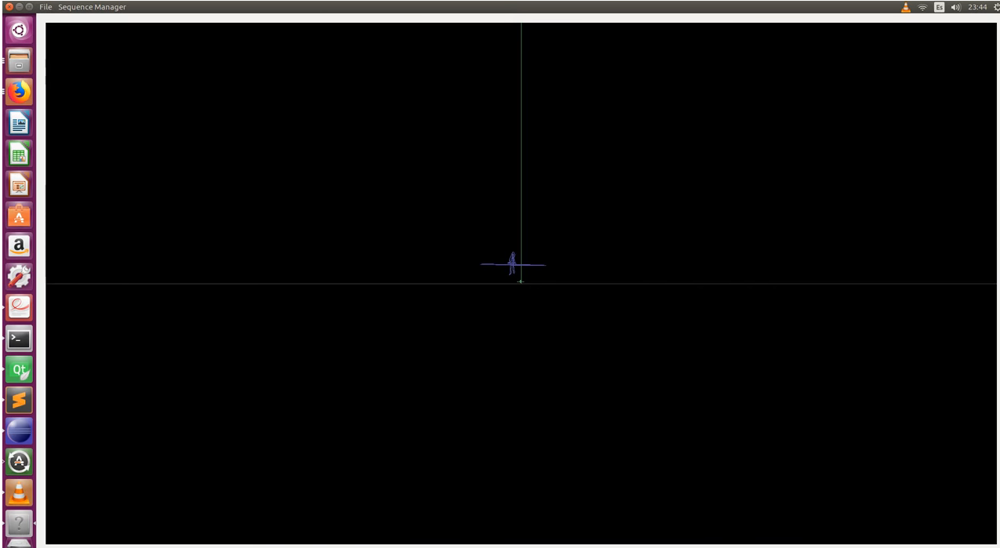

## 1st to 31th of August

Reading about c++ QT gui tool Implemeting some test with QT Created a very first version of gui for slamtestbed using QT Added a basic menu to perform traslation and scale modifications over 3D data sequence Uploaded new video 

