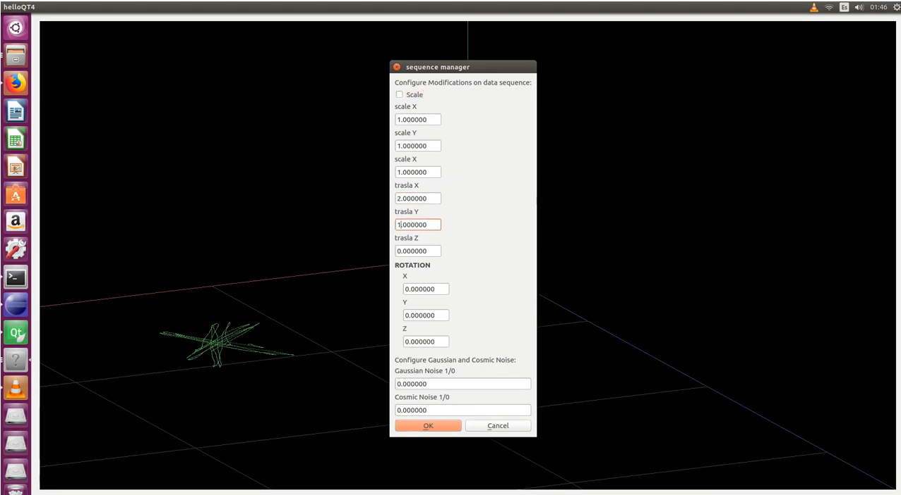

## 26th to 28th September:

Added scale estimation

new video uploaded to youtube,( RobotSpirit channel) 

## 19th to 26 September:

Including the register module on the QT application.

The system is able to estimate wich rotation and traslation was performed over original data

New gui dialog showing parameters of estimated transformation such as scale, rotation and traslation

New View menu, to show 3d data as point or lines

New exit button added to file menu to close de application

Added new video on youtube 

## 1st to 19th September: 

Creating new QT dialog for transforming data set. Including scale, traslation, rotation , gaussian noise and cosmic noise Improving general features of qt 3d interface 

