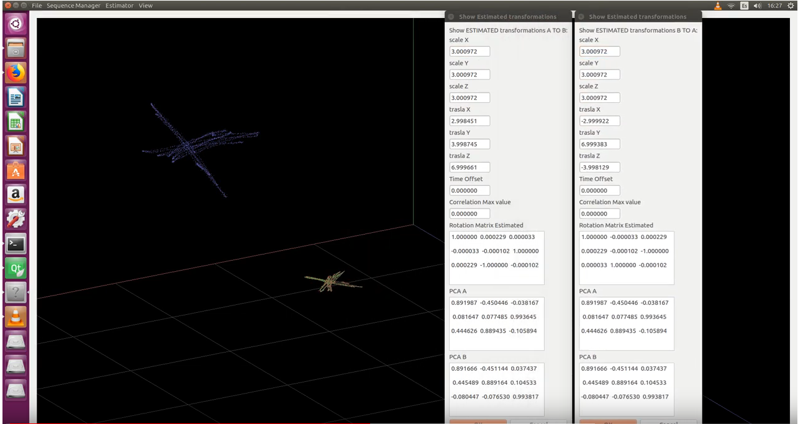

## 18th October to 31th October: 

Working on testing and checking accuracy of estimated calculus

Added new estimating direction.

Previously , only estimating transformations from Dataset B to Dataset A

Now , is possible to estimate transformations from Dataset A to Dataset B

Found more reliable estimated calculus with transformations from Dataset A to DataSet B. To investigate

Added new video 

## 4th October to 18th October 

Working on estimating offset with interpolation Uploade code to github

## 28th September to 4th October

Added estimation of time offset

Still working on adapting interpolation

Updated code on github 

